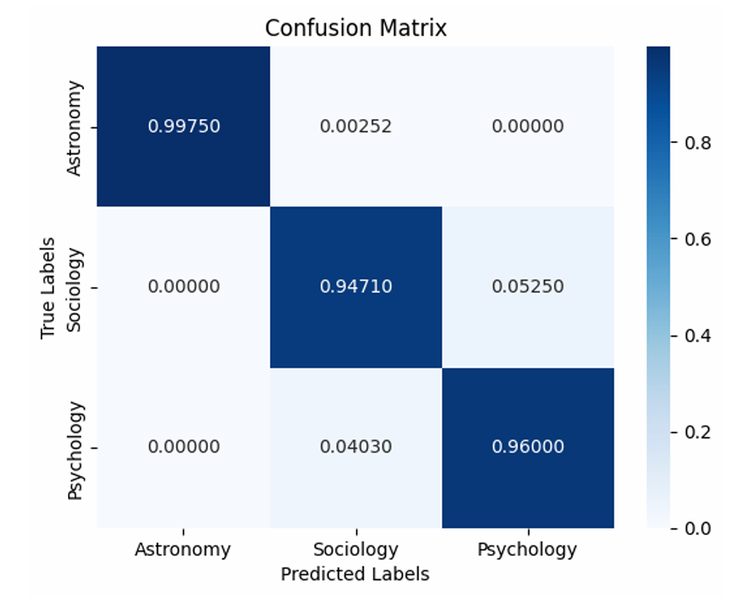

# Scientific Paper Abstract Classification
>Training a natural language processing model to classify scientific journal abstracts on academic fields

# Table of Contents
- [Specifications](#specifications)
    - [Natural language processing model](#natural-language-processing-model)
    - [Classifying model](#classifying-model)
    - [Dataset](#dataset)
    - [Data training split](#data-training-split)
- [Requirements](#requirements)
- [Performance](#performance)
- [How to use](#how-to-use)
    - [Training](#training)
    - [Classifying](#classifying)

# Specifications
### Natural language processing model
BERT Cased with 12 layers
### Classifying model
Linear feed-forward neural network model
### Dataset
400 abstracts each per academic field (astronomy, sociology, psychology). Obtained from Crossref API.
### Data training split
K-fold cross validation with further training-test split. 3/5 training, 1/5 evaluation, 1/5 testing, for 5 folds 

# Requirements
* requirements.txt
* python 3.11.4

# Performance

# How to use 
### Training
**Computer with a GPU is recommended for faster training time**
1. Install the correct python version, prerequisites, and dataset
2. Run the whole classify.ipynb file

### Classifying
**⚠️TRAINING MUST BE DONE AT LEAST ONCE**
1. Run the "Predicting" cell (the final cell)
2. Give an input 
3. The predicted academic field will be returned
